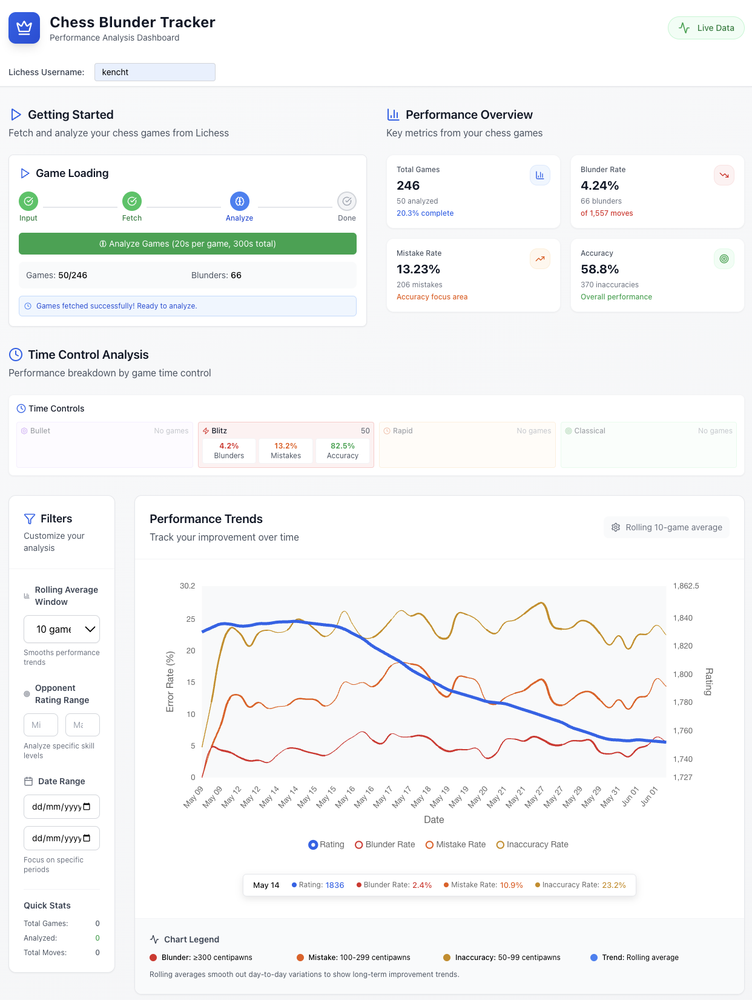

# 🎯 Blunderometer

A comprehensive chess analysis tool that fetches your Lichess games and analyzes them to identify blunders, mistakes, and inaccuracies using Stockfish engine analysis.

> **Track your chess improvement with detailed game analysis, real-time progress tracking, and comprehensive statistics.**

## 📸 Screenshot



*The Blunderometer dashboard showing game analysis, performance metrics, and improvement trends over time.*

## 🚀 Features

### Game Analysis
- **Per-Game Time Limits**: Set individual time limits for each game analysis (10-60 seconds)
- **Session Time Limits**: Optional total session time limits to control overall analysis duration
- **Real-time Progress Tracking**: Live countdown timers and progress bars during analysis
- **Comprehensive Move Evaluation**: Identifies blunders (≥300cp), mistakes (≥100cp), and inaccuracies (≥50cp)

### Data Management
- **Lichess Integration**: Automatically fetch games from Lichess API
- **Multi-User Support**: Separate databases for different users with true concurrency
- **Incremental Updates**: Fetch only new games or fill in historical gaps
- **Persistent Storage**: SQLite database with full game and move history
- **Concurrent Analysis**: Multiple users can analyze games simultaneously

### Visualization & Analytics
- **Performance Charts**: Track your improvement over time
- **Time Control Analysis**: Compare performance across different time controls
- **Detailed Statistics**: Comprehensive stats on games, moves, and errors
- **Interactive Dashboard**: Modern React-based UI with real-time updates

### Session Management
- **Automatic Timeout**: Inactive user sessions are cleaned up after 60 seconds to free resources
- **Keep-alive Mechanism**: Frontend automatically sends periodic pings to maintain active sessions
- **Resource Protection**: Maximum concurrent analyses limit prevents server overload
- **Graceful Cleanup**: Proper cleanup when users close browser tabs or disconnect## 🛠️ Technical Stack

### Backend
- **Python 3.12+** - Core application logic
- **Flask** - Web API and serving
- **SQLAlchemy** - Database ORM
- **Stockfish** - Chess engine for analysis
- **python-chess** - Chess game manipulation
- **asyncio** - Asynchronous game processing

### Frontend
- **React 18** - Modern UI framework
- **TypeScript** - Type-safe development
- **Tailwind CSS** - Utility-first styling
- **Chart.js** - Data visualization
- **Lucide React** - Icon library

### Database
- **SQLite** - Lightweight, file-based database
- **Multi-tenant** - Separate databases per user

## 📦 Quick Start

### Prerequisites
- Python 3.12 or higher
- Node.js 18 or higher
- Stockfish chess engine

### 1. Install Stockfish Chess Engine

**macOS (with Homebrew):**
```bash
brew install stockfish
```

**Ubuntu/Debian:**
```bash
sudo apt-get install stockfish
```

**Windows:**
1. Download from [Stockfish official site](https://stockfishchess.org/download/)
2. Extract and add to your PATH, or note the installation location

### 2. Clone and Setup

```bash
# Clone the repository
git clone https://github.com/timkench/blunderometer.git
cd blunderometer

# Setup Python backend
python -m venv venv
source venv/bin/activate  # Windows: venv\Scripts\activate
pip install -r requirements.txt

# Setup React frontend
cd frontend
npm install
cd ..
```

### 3. Verify Setup (Optional)

Run the setup checker to verify everything is configured correctly:

```bash
python check_setup.py
```

This will check your Python version, Node.js, Stockfish installation, and all dependencies.

### 4. Configure Stockfish (if needed)

If Stockfish is not in your PATH or in `/opt/homebrew/bin/stockfish`, edit `game_analyzer.py`:

```python
# Line 12-15: Update this path to match your Stockfish installation
engine_path = "/your/path/to/stockfish"  # Update this line
```

Common paths:
- **macOS Homebrew**: `/opt/homebrew/bin/stockfish`
- **Ubuntu**: `/usr/bin/stockfish`  
- **Windows**: `C:\Path\To\stockfish.exe`

## 🚀 Running the Application

### Start Both Servers

**Terminal 1 - Backend:**
```bash
cd blunderometer
source venv/bin/activate  # Windows: venv\Scripts\activate
python app.py
```
✅ Backend running at `http://localhost:5001`

**Terminal 2 - Frontend:**
```bash
cd blunderometer/frontend
npm start
```
✅ Web interface at `http://localhost:3000`

### First Time Setup

1. **Open your browser** to `http://localhost:3000`
2. **Enter your Lichess username** (e.g., `magnus`, `hikaru`, etc.)
3. **Click "Fetch 50 Newer Games"** to download recent games
4. **Wait for fetch to complete**, then click "Start Analysis"
5. **Watch the real-time progress** with countdown timers
6. **Explore your results** in the dashboard!

### 📋 What You'll See

**During Game Fetching:**
- Progress indicator showing games downloaded
- Message: "Fetching 50 newer games from Lichess..."
- Completion: "Games fetched successfully! Ready to analyze."

**During Analysis:**
- Real-time countdown timer for current game
- Progress bar showing games analyzed (e.g., "14 / 50")
- Current game ID being processed
- Time estimates and session limits
- Games analyzed vs skipped counts

**In the Dashboard:**
- Total games and analysis progress
- Blunder/mistake/inaccuracy statistics
- Performance charts over time
- Time control breakdowns
- Recent games with analysis status

### ✅ What Success Looks Like

**Terminal 1 (Backend):**
```
 * Running on all addresses (0.0.0.0)
 * Running on http://127.0.0.1:5001
 * Running on http://[::]:5001
 * Debug mode: on
```

**Terminal 2 (Frontend):**
```
Compiled successfully!

You can now view frontend in the browser.
  Local:            http://localhost:3000
  On Your Network:  http://192.168.1.100:3000
```

**Browser (localhost:3000):**
- Modern chess-themed dashboard loads
- Username input field is ready
- "Game Loading" workflow panel visible
- Statistics panels show "No data available" until you add games

**After entering username and fetching games:**
- "Games fetched successfully!" message appears
- Analysis button becomes available
- Statistics update with game counts

**During analysis:**
- Real-time countdown timer (e.g., "Per game limit: 0:15")
- Progress bar animating (e.g., "28 / 50 games")  
- Current game ID displayed (e.g., "Current: YdH3exjD")
- Completion stats updating ("Completed: 14 | Skipped: 0")

### Example Workflow

```bash
# Terminal 1
cd blunderometer
source venv/bin/activate
python app.py
# Server starts at http://localhost:5001

# Terminal 2  
cd blunderometer/frontend
npm start
# Frontend opens at http://localhost:3000

# In browser at localhost:3000:
# 1. Enter username: "your_lichess_username"
# 2. Click "Fetch 50 Newer Games" 
# 3. Wait for "Games fetched successfully!"
# 4. Click "Start Analysis"
# 5. Watch real-time progress and countdown timers
# 6. View your blunder analysis results!
```

## 📊 Understanding the Results

### Move Classifications
- **Blunder**: Moves losing ≥300 centipawns (major mistakes)
- **Mistake**: Moves losing ≥100 centipawns (significant errors)
- **Inaccuracy**: Moves losing ≥50 centipawns (minor imprecisions)

### Performance Metrics
- **Games Analyzed**: Total games with complete analysis
- **Average Centipawn Loss**: Overall accuracy metric
- **Error Distribution**: Breakdown by time control and rating
- **Improvement Trends**: Track progress over time

## ⚙️ Configuration Options

**Analysis Settings:**
- **Games to Fetch**: 25-200 games per batch
- **Per Game Time**: 10-60 seconds per game (balance speed vs accuracy)
- **Total Session Time**: 300-1800 seconds (optional session limit)

**Recommended Settings:**
- **Quick Analysis**: 10s per game, 600s total (10 minutes max)
- **Balanced**: 20s per game, no total limit (default)
- **Deep Analysis**: 45s per game, no total limit (most accurate)

### 🎯 Analysis Features

- **Real-time Progress**: Watch games being analyzed with countdown timers
- **Time Management**: Set per-game limits to balance speed vs accuracy  
- **Session Control**: Use total time limits for quick analysis sessions
- **Detailed Tracking**: See current game being analyzed and completion stats
- **Multi-User Support**: Each username gets its own separate database

### ⚡️ Concurrent Usage

Blunderometer supports true concurrent multi-user operation:

- **Simultaneous Analysis**: Up to 2 users can analyze games at the same time
- **Per-User State Tracking**: Each user's operations are tracked independently
- **Resource Management**: CPU usage is controlled to prevent server overload
- **Browser Support**: Any number of users can browse their stats simultaneously

For more details on the concurrency model, see [CONCURRENCY.md](CONCURRENCY.md).

### 🔧 Troubleshooting

**Common Issues:**

1. **"Stockfish not found" error:**
   - Install Stockfish: `brew install stockfish` (macOS) or `sudo apt install stockfish` (Linux)
   - Update path in `game_analyzer.py` line 12-15

2. **"Port already in use" error:**
   - Kill existing processes: `pkill -f "python app.py"` and `pkill -f "npm start"`
   - Try different ports in `app.py` (line 475) and restart

3. **Games not fetching:**
   - Check your Lichess username is correct (case-sensitive)
   - Ensure you have public games on Lichess
   - Try fetching fewer games (25 instead of 200)

4. **Analysis stuck/slow:**
   - Reduce per-game time limit (try 10-15 seconds)
   - Add a total session time limit
   - Check Stockfish is working: `stockfish` in terminal should open the engine

5. **Frontend won't start:**
   - Ensure Node.js 18+ is installed: `node --version`
   - Clear npm cache: `npm cache clean --force`
   - Delete `node_modules` and reinstall: `rm -rf node_modules && npm install`
